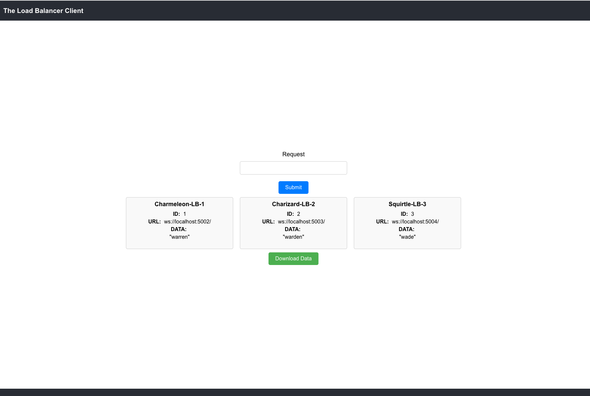

# WebSocket Load Balancer

This project aims to create a WebSocket Load Balancer using Node.js, facilitating efficient distribution of WebSocket connections among a group of backend servers. 

## Features
- **Load Balancing:** Distributes WebSocket connections evenly among backend servers to optimize resource utilization.
- **Round-Robin Algorithm:** Utilizes a round-robin algorithm to ensure fair allocation of connections across servers.
- **Seamless Integration:** Easily integrates with existing WebSocket-based applications to improve scalability and reliability.
- **CORS Support:** Handles Cross-Origin Resource Sharing (CORS) to enable communication between client-side applications and the load balancer.
- **Health Checks:** Periodically checks the health of backend servers to only send data to available servers, improving reliability.
- Display the servers in the ui and data being sent through them
- Retrieve all data sent through the lb to the servers from one database

## Usage
1. Clone the repository.
2. Go into the different folders and install dependencies using `npm install`.
3. Start the WebSocket Load Balancer server with `node lb.js` along with the other servers and client.
4. Ensure backend WebSocket servers are running and accessible.
5. Connect client applications to the load balancer for optimized WebSocket communication.

